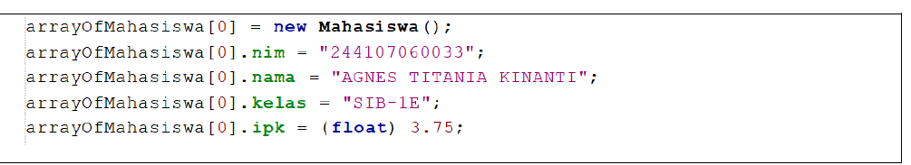
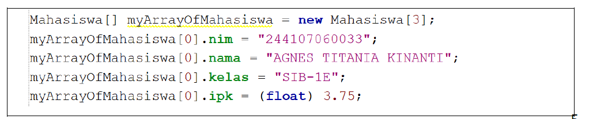

# Jobsheet-3
## Praktikum 3.2
### Pertanyaan
1. Berdasarkan uji coba 3.2, apakah class yang akan dibuat array of object harus selalu memiliki atribut dan sekaligus method? Jelaskan!
2. Apa yang dilakukan oleh kode program berikut?

3. Apakah class Mahasiswa memiliki konstruktor? Jika tidak, kenapa bisa dilakukan pemanggilan konstruktur pada baris program berikut?

4. Apa yang dilakukan oleh kode program berikut?

5. Mengapa class Mahasiswa dan MahasiswaDemo dipisahkan pada uji coba 3.2?

### Jawaban
1. Tidak harus. Sebuah class untuk array of object minimal harus memiliki atribut agar bisa menyimpan data. Namun, penambahan method (seperti untuk mencetak data atau menghitung nilai) sangat disarankan agar kode lebih rapi dan mengikuti prinsip Pemrograman Berorientasi Objek (OOP).
2. Baris kode tersebut melakukan deklarasi dan instansiasi array of object. Kode ini menyiapkan sebuah variabel array bernama arrayOfMahasiswa yang dapat menampung maksimal 3 referensi objek dari class Mahasiswa.
3. Secara eksplisit dalam kode awal tidak terlihat, namun Java secara otomatis menyediakan Default Constructor (konstruktor tanpa parameter) jika kita tidak menulisnya sendiri. Itulah sebabnya perintah new Mahasiswa() tetap bisa dijalankan untuk membuat objek baru di dalam indeks array.
4. 
- Instansiasi objek: Membuat objek Mahasiswa nyata pada indeks ke-0 dari array.
- Assignment (Pengisian data): Memberikan nilai ke setiap atribut (nim, nama, kelas, ipk) pada objek yang ada di indeks ke-0 tersebut.
5. Pemisahan ini bertujuan untuk menerapkan konsep Modulariatas dan Separation of Concerns. Mahasiswa berfungsi sebagai model data (blueprint), sedangkan MahasiswaDemo berfungsi sebagai pengelola alur program (driver class).

## Praktikum 3.3
### Pertanyaan
1. Tambahkan method cetakInfo() pada class Mahasiswa kemudian modifikasi kode program pada langkah no 3.
2. Misalkan Anda punya array baru bertipe array of Mahasiswa dengan nama myArrayOfMahasiswa. Mengapa kode berikut menyebabkan error?

### Jawaban
1. Sudah
2. karena objek pada indeks array belum diinstansiasi.

## Pertanyaan 3.4
### Pertanyaan 
1. Apakah suatu class dapat memiliki lebih dari 1 constructor? Jika iya, berikan contohnya
2. Tambahkan method tambahData() pada class Matakuliah, kemudian gunakan method tersebut di class MatakuliahDemo untuk menambahkan data Matakuliah
3. Tambahkan method cetakInfo() pada class Matakuliah, kemudian gunakan method tersebut di class MatakuliahDemo untuk menampilkan data hasil inputan di layar
4. Modifikasi kode program pada class MatakuliahDemo agar panjang (jumlah elemen) dari array of object Matakuliah ditentukan oleh user melalui input dengan Scanner

### jawaban 
1. sudah
2. sudah
3. sudah
4. sudah